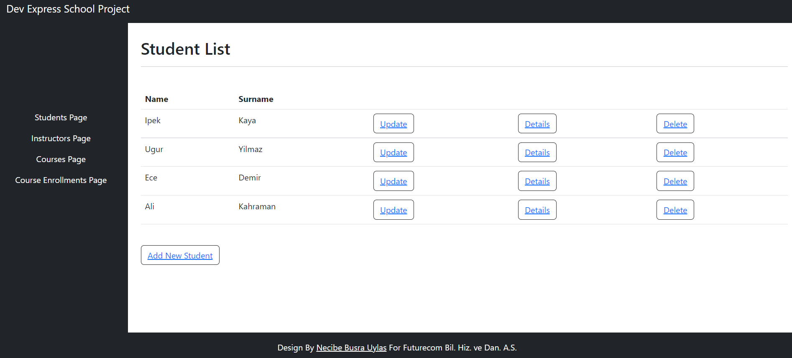
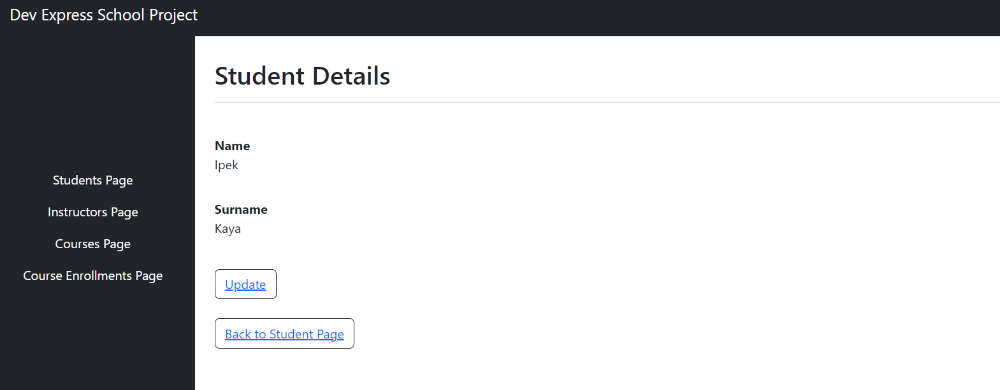
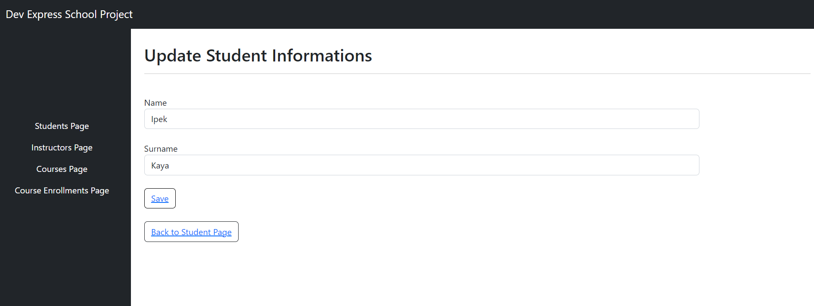
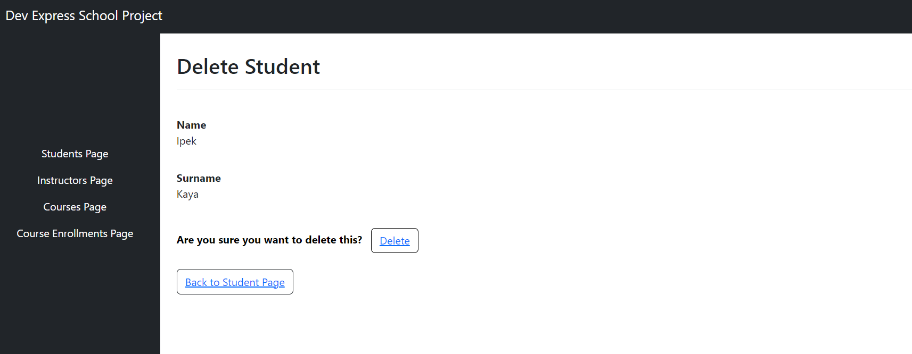

# DevExtremeMvcSchoolApp

DevExtremeMvcSchoolApp is a DevExtreme ASP.NET MVC Application.

## Database Models

The database of the project is a MSSQL database. The database consists of 4 tables;  Student, Instructor, Course, and CourseEnrollment. You can find the SQL query for the database in => [Database](DevExtremeMvcSchoolApp//SchoolDatabase.sql)

## Project Images

The same page design is used all over the project pages. Below you can see some of the pages in the project.

### **1.Student Page**

### **2. Student Details Page**

### **3. Student Update Page**

### **4. Student Delete Page**

